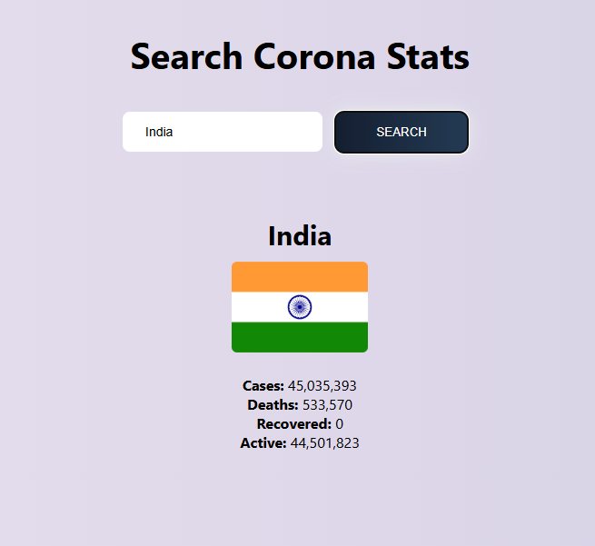

# Corona Stats Search

A simple **web-based app** to search and display COVID-19 statistics for any country using the [disease.sh API](https://disease.sh/).

---

## Features

- Search COVID-19 stats by **country name**
- Display includes:
  - Country name & flag
  - Total cases
  - Total deaths
  - Total recovered
  - Active cases
- Simple, clean, and responsive design
- Error handling for invalid country names

---

## Demo

;  

---

## Usage

1. Open the `index.html` file in your browser.
2. Enter the **country name** in the input box.
3. Click **Search** to fetch the latest COVID-19 statistics.
4. Stats will be displayed below the input.

---

## Code Overview

- **HTML**: Basic structure with an input box, button, and a result section.
- **CSS**: Styling file `style.css` for layout and responsiveness.
- **JavaScript**:
  - Fetches data from `https://disease.sh/v3/covid-19/countries/{country}`
  - Uses `fetch` API with `async/await`
  - Updates the DOM with fetched data
  - Handles errors like invalid country names

---

## Technologies Used

- HTML5
- CSS3
- JavaScript (ES6+)
- [disease.sh API](https://disease.sh/)

---

## How It Works

1. User enters a country name and clicks the **Search** button.
2. JavaScript fetches COVID-19 data from the API.
3. Data is converted to JSON and displayed on the page.
4. Errors (like invalid country names) are handled gracefully.

---

## Future Improvements

- Add **auto-suggestions** for country names.
- Include **historical data** and charts.
- Enhance UI with better styling or frameworks like Bootstrap.

---

## License

This project is **open-source** and free to use.
