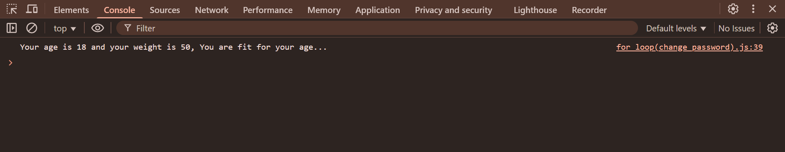
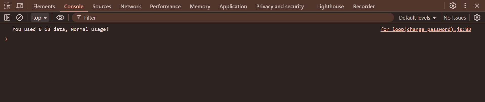
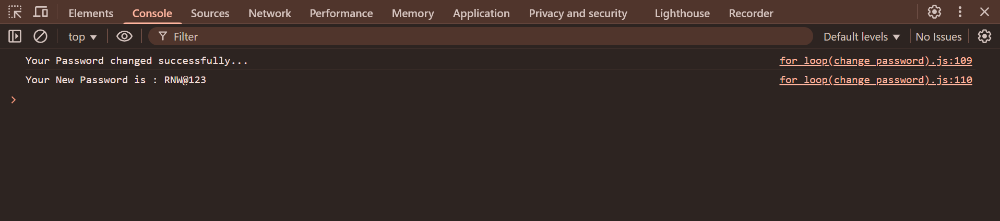

# 📌 Smart Life Assistant

**Smart Life Assistant** is a collection of 4 simple and useful JavaScript programs that help manage everyday decisions like health, finance, internet usage, and security.  
It is designed for beginners to learn basic JavaScript concepts using `prompt()` for input and `console.log()` for output.

---

## 📝 Project Description

This project includes:
1. Fitness Suggestion System
2. Monthly Budget Planner
3. Mobile Data Usage Alert System
4. Change Password System

Each task runs sequentially and displays clear, friendly output.

---

## 🛠 Tasks & Logic

### 1️⃣ Fitness Suggestion System
**Purpose:** Suggests if you are fit, underweight, or overweight for your age.  
**Logic:**
- Each age group has an ideal weight.
- A ±5 kg range is considered fit.
- Outside the range → suggests exercise or healthy diet.

---

### 2️⃣ Monthly Budget Planner
**Purpose:** Gives a simple budget suggestion based on your monthly income.  
**Logic:**
- `< ₹10,000` → Spend cautiously and save more.
- `₹10,000 – ₹29,999` → Balanced budget.
- `≥ ₹30,000` → Consider investing.

---

### 3️⃣ Mobile Data Usage Alert System
**Purpose:** Analyzes monthly data usage and gives usage level.  
**Logic:**
- `< 5GB` → Low usage.
- `5GB – 15GB` → Normal usage.
- `> 15GB` → Heavy usage, upgrade your plan.

---

### 4️⃣ Change Password System
**Purpose:** Allows secure password change.  
**Logic:**
- Old password must match current password.
- New password cannot be the same as the old one.
- New password must match confirm password.

---

## 📸 Output Screenshots 

**1. Fitness Suggestion System**

**2. Monthly Budget Planner**

**3. Monthly Budget Planner**

**4. Change Password**

