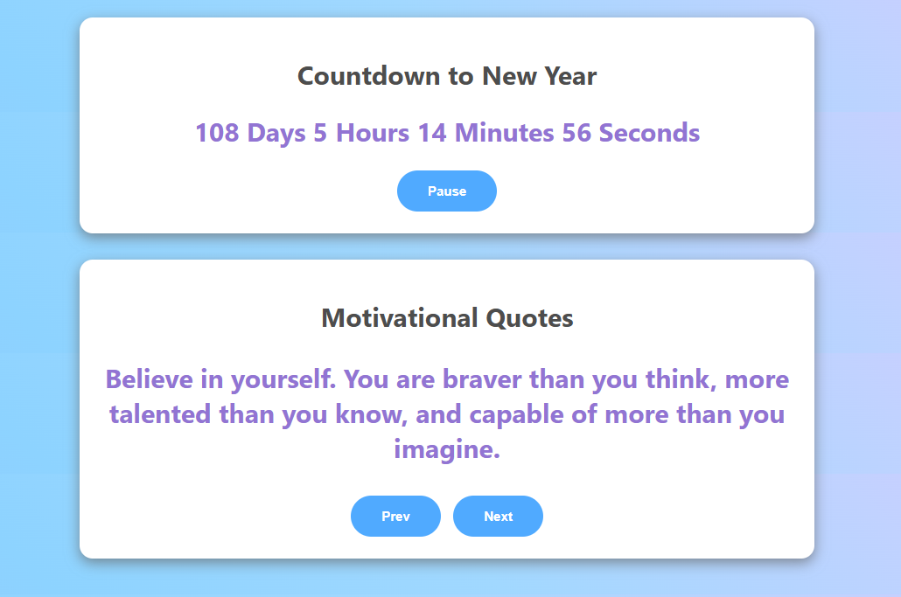
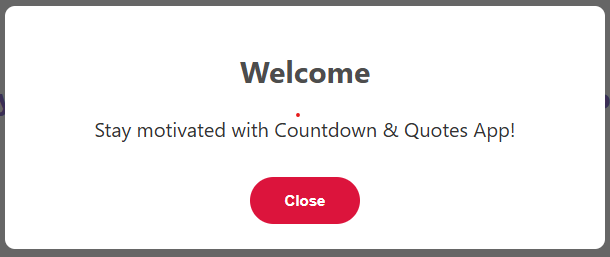

# ⏳ Countdown & Quotes Application  

An interactive web application that combines a **countdown timer** for New Year, a **motivational quotes slider**, and a **welcome modal popup**.  
Built with **HTML, CSS, and JavaScript** for a smooth and engaging user experience.  

---

## ✨ Features  

### 🎯 Countdown Timer  
- Real-time countdown to **New Year 2026**  
- Start / Pause / Resume functionality  
- Displays **Days, Hours, Minutes, Seconds**  
- Shows a celebratory message once the countdown ends 🎉  

### 💡 Motivational Quotes  
- Automatic **quote slider** (changes every 4 seconds)  
- Manual navigation with **Prev / Next** buttons  
- Smooth looping through an array of motivational quotes  

### 🪟 Modal Popup  
- A **welcome modal** appears 5 seconds after page load  
- Encourages users with a motivational message  
- Can be dismissed using the **Close** button  

---

## 🛠️ Technologies Used  
- **HTML5** – Structure  
- **CSS3** – Styling with gradients, shadows, and responsiveness  
- **JavaScript (ES6)** – Dynamic functionality with `setInterval`, `setTimeout`, DOM manipulation, and event listeners  

---

## 📂 Project Structure  

```
Countdown-Quotes-App/
├── index.html      # Main HTML file
├── style.css       # Styling file
└── script.js       # JavaScript functionality
```

---

## 📸 Preview  

### ⏳ Countdown Section  
Displays the remaining time to **New Year 2026** with **Pause / Resume** option.  

  

---

### 🪟 Modal Popup  
Appears **5 seconds** after page load to greet the user with a **welcome message**.  

  

---

## 🚀 How to Run the Project  

1. Copy the project code into a file named `index.html`.
2. Open the file in any modern browser (e.g., Chrome, Edge, Firefox).
3. Open the **browser console** (`Ctrl + Shift + J` in Chrome) to see the output.
4. Follow the prompts to enter your travel details.
