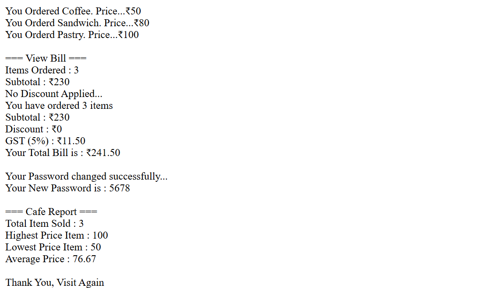

# ☕ Smart Café Billing System

This project is a mini JavaScript-based billing system for a café.  
It demonstrates **basic programming logic, conditionals, loops, and user input** using `prompt` and `console.log`.

---

## 📝 Project Description

The program allows customers to order items, calculates the bill, applies discounts, adds GST, and generates a café sales report. It also includes a simple **password change system**.

---

## 🛠 Features & Logic

### 1️⃣ Ordering System
- **Menu Options:**
  - Coffee → ₹50
  - Tea → ₹30
  - Sandwich → ₹80
  - Pastry → ₹100
- Keeps track of:
  - Total items ordered
  - Subtotal price
  - Highest, lowest, and average item price

---

### 2️⃣ Discount System
- **Logic:**
  - Bill > ₹1000 → 20% discount  
  - Bill > ₹500 → 10% discount  
  - Otherwise → No discount  

---

### 3️⃣ GST & Final Bill
- **GST:** 5% added after discount  
- **Final Bill = (Subtotal - Discount) + GST**

---

### 4️⃣ Café Report
- Total items sold
- Highest price item
- Lowest price item
- Average price per item

---

### 5️⃣ Change Password System
- **Input:** Old password, new password, confirm password  
- **Logic:**
  - New password ≠ Old password  
  - New password = Confirm password  
  - If valid → Password updated successfully  

---
## 📸 Output Screenshots 

---

## 🚀 How to Run
1. Clone or download this repository.  
2. Open `index.html` in any browser.  
3. Open **Developer Console** (Right Click → Inspect → Console).  
4. Enter your choices when prompted.  
5. View results directly in the console.  
