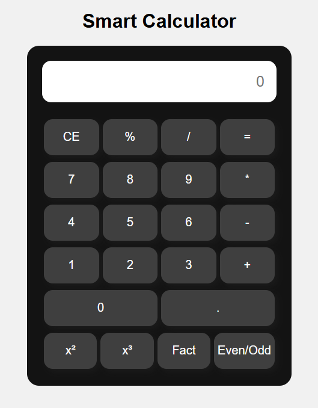

# 🧮 Smart Calculator

This project is a mini **JavaScript-based calculator**.  
It demonstrates **basic arithmetic operations, number logic, and mathematical functions** using HTML, CSS, and JavaScript.

---

## 📝 Project Description

The calculator allows users to perform simple arithmetic, find squares, cubes, factorials, and check if a number is even or odd.  
It uses **DOM manipulation** and simple **JavaScript functions** to handle calculations.

---

## 🛠 Features & Logic

### 1️⃣ Arithmetic Operations
- **Operators:**
  - Addition (+)
  - Subtraction (-)
  - Multiplication (*)
  - Division (/)
  - Modulus (%)
- Uses `eval()` for basic expression evaluation.

---

### 2️⃣ Special Functions
- **Square (x²):** Multiplies the number by itself.  
- **Cube (x³):** Multiplies the number three times.  
- **Factorial (n!):** Product of all positive integers ≤ n.  
- **Even/Odd:** Checks if the number is divisible by 2.  

---

### 3️⃣ Input & Output
- **Input:** User clicks buttons → numbers/operators appear on display.  
- **Output:** Result shown in the calculator display.  

---

### 4️⃣ Error Handling
- Invalid input shows `"Error"` or `"Invalid"` messages.  
- Prevents negative factorials or non-numeric inputs.

---

## 📸 Output Screenshots 

---

## 🚀 How to Run
1. Clone or download this repository.  
2. Open `index.html` in any browser.  
3. Use the on-screen buttons to calculate.  
4. View results instantly in the calculator display.  

