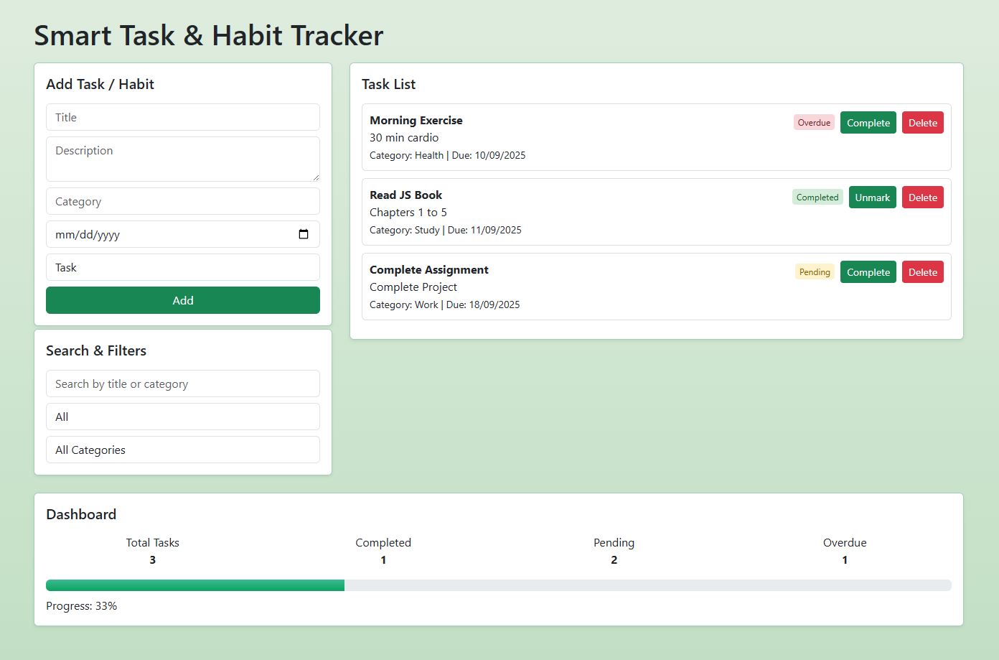

# 🧩 Smart Task & Habit Tracker

A simple web application to **add, manage, filter, and track tasks & habits**.  
All data is stored **in-memory**, meaning it will reset when the page is refreshed.

---

## 📂 Project Structure

```text
Smart-Task-Habit-Tracker/
├── index.html                  # Main HTML file
├── css/
│   ├── bootstrap.min.css       # Bootstrap CSS
│   └── style.css               # Custom styles
├── js/
│   ├── bootstrap.bundle.min.js # Bootstrap JS
│   └── script.js               # JavaScript functionality
└── README.md                   # Project documentation
```
---

## 📝 Features

- Add **Tasks** or **Habits** with:
  - Title (required)
  - Description
  - Category
  - Due Date
  - Type (Task / Habit)

- **Task/Habit Management**:
  - Mark as Complete / Unmark
  - Delete tasks
  - Dashboard updates automatically

- **Filters & Search**:
  - Search by title or category
  - Filter by status: All / Pending / Completed / Overdue
  - Filter by category

- **Dashboard**:
  - Total Tasks
  - Completed
  - Pending
  - Overdue
  - Progress bar showing % of completed tasks

---

## 💻 How It Works

1. **HTML Elements**
   - `#taskForm` → Form to add new tasks/habits
   - `#tasksContainer` → Container that shows all tasks dynamically
   - `#searchInput` → Search box
   - `#statusFilter` → Dropdown to filter by task status
   - `#categoryFilter` → Dropdown to filter by category
   - Dashboard Elements: `#totalTasks`, `#completedTasks`, `#pendingTasks`, `#overdueTasks`, `#progressBar`, `#progressText`

2. **JavaScript Logic**
   - `Task` class → Blueprint for every task
   - `SpecialHabit` class → Inherits Task and adds `frequency`
   - `tasks` array → Stores all task objects in memory
   - `renderTasks()` → Dynamically shows tasks in `#tasksContainer`
   - `renderDashboard()` → Updates total, completed, pending, overdue, and progress bar
   - `addTask()` → Adds task or habit to `tasks` array
   - `deleteTask()` → Removes a task by its `id`
   - Event listeners for **form submit**, **search input**, and **filters** trigger re-rendering

3. **Task Status**
   - Pending → Default status
   - Completed → Click "Complete" button
   - Overdue → Calculated automatically based on due date

4. **Category Filters**
   - Categories are **dynamic** based on tasks added
   - Always includes an "All Categories" option

---

## 🎨 Styling

- Uses **Bootstrap 5** for layout and components.
- Custom CSS for:
  - Task cards (`.task-card`)
  - Task status badges (`.status-completed`, `.status-pending`, `.status-overdue`)
  - Progress bar gradient (`.progress-fill`)
  - Smooth flex layout for task items

---

## 🚀 How to Use

1. Open `index.html` in your browser.
2. Fill out the form to add a Task or Habit.
3. Use **search** or **filters** to find tasks.
4. Click **Complete** to mark tasks done or **Delete** to remove them.
5. View **Dashboard** to see progress and task stats.

---

## 📌 Screenshots



---

## ⚠️ Notes

- All data is **stored in memory**, so refreshing the page will **clear all tasks**.
- This is a simple **front-end only** application with no database.

## 👩‍💻 Author

Mitali Patel
