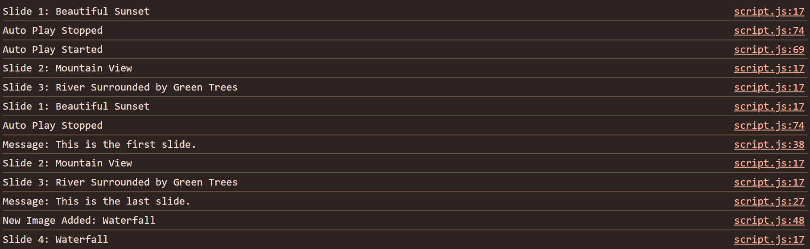

# 🖼️ Smart Image Slider  

A simple and interactive **image slider web application** built with **HTML, CSS, and JavaScript**.  
It allows users to navigate through slides, add custom images with captions, and enable/disable autoplay.  

---

## 📝 Project Description  

This project demonstrates the use of:  
- **DOM Manipulation** (`getElementById`, `innerText`, `src`)  
- **Arrays** (to store images and captions)  
- **Functions** (`nextSlide`, `prevSlide`, `addImage`, `startAutoPlay`, `stopAutoPlay`)  
- **setInterval / clearInterval** (for autoplay functionality)  
- **CSS Styling** (gradients, transitions, shadows, responsive layout)  

The app runs fully in the **browser** with smooth navigation and a modern UI.  

---

## 🚀 Features  

- ⬅️➡️ Navigate using **Previous / Next** buttons  
- 🎬 **Auto Play** slides every 3 seconds  
- ⏸️ Pause autoplay anytime  
- ➕ Add your own **image URL + caption** dynamically  
- 📝 Slide counter showing current slide out of total  
- ⚡ Gradient background, rounded corners, and smooth transitions  

---

## 📂 Project Structure  

Smart-Image-Slider/  
│── index.html      # Main HTML file  
│── style.css       # Styling (CSS)  
│── script.js       # Functionality (JavaScript)  
│── images/         # Default images folder  
│── screenshots/    # Screenshots for README  

---

## 🧩 Project Preview  

  

---

## 🧩 Console 

  

---

## 🎮 How to Run  

1. Download or clone the repository.  
2. Open `index.html` in any modern browser (Chrome, Edge, Firefox).  
3. Use the **❮ Prev / Next ❯** buttons to navigate.  
4. Click **Auto Play** to start slideshow (3s interval).  
5. Add your own images:  
   - Enter an **Image URL**  
   - Enter a **Caption**  
   - Click **Add Image** → New slide will appear.  

---

## 👩‍💻 Author  

**Mitali Patel**  

✨ Created as a mini-project using HTML, CSS, and JavaScript.  