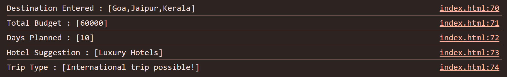

# 🌍 Smart Travel Planner

A simple **JavaScript-based console application** that helps users plan their travel.  
The program takes destinations, budget, and travel days as input and provides a **trip summary with suggestions**.

---

## 📝 Project Description

This project demonstrates the use of:
- Variables
- Loops (`for`)
- Conditional statements (`if-else`)
- Functions (Arrow function for hotel suggestion)
- Arrays (`push`, `toString`)
- Template literals for neat output

The user interacts with the program via **prompt inputs**, and results are shown in the **console**.

---

## 🚀 Features

- ✈️ Enter **multiple destinations** (3–5).  
- 💰 Enter **budget** and get suggestions:
  - Short domestic trip
  - Long domestic trip
  - International trip
- 🗓️ Enter **number of travel days** to classify the trip:
  - Weekend Getaway
  - Perfect Holiday Trip
  - Extended Vacation
- 🏨 Get **hotel suggestions** based on per-day budget:
  - Budget Hotels
  - Mid-range Hotels
  - Luxury Hotels
- 📌 Final travel summary displayed in the console.

---

## 🧩 Program Output

---

## 📂 How to Run

1. Copy the project code into a file named `index.html`.
2. Open the file in any modern browser (e.g., Chrome, Edge, Firefox).
3. Open the **browser console** (`Ctrl + Shift + J` in Chrome) to see the output.
4. Follow the prompts to enter your travel details.
