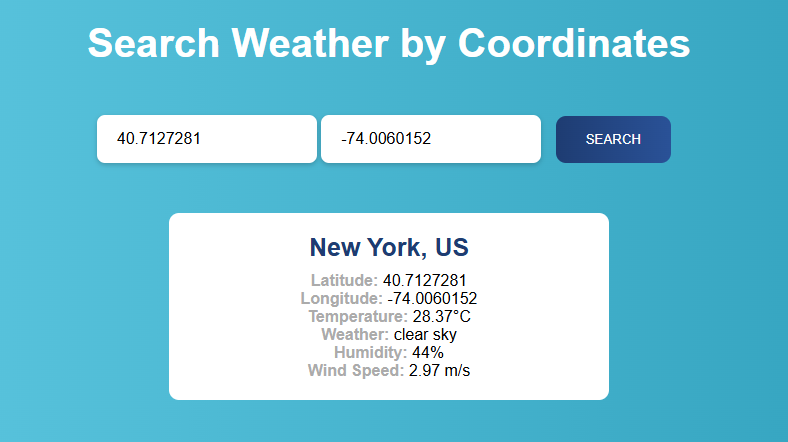

# 🌦️ Weather Search by Coordinates

This is a simple **web app** that allows you to search for current weather using **latitude and longitude** values.  
It fetches live weather data from the [OpenWeatherMap API](https://openweathermap.org/api).

---

## 🚀 Features
- Enter **Latitude** and **Longitude** to get weather info.
- Shows:
  - City & Country
  - Latitude & Longitude
  - Current Temperature (°C)
  - Weather Description
  - Humidity
  - Wind Speed
- Easy-to-use UI with clean layout.
- Handles invalid coordinates or API errors.

---

## 📂 Project Files
```

weather-app/
│── index.html      # Main HTML (contains JS script)
│── style.css       # CSS styling for layout and design
│── README.md       # Project documentation

```

---

## 🛠️ How to Run

1. Clone or download this repository.
2. Open `index.html` in your browser.
3. Replace the placeholder API key inside the script with your own from OpenWeatherMap:
   ```javascript
   const apiKey = "YOUR_API_KEY";
4. Enter latitude and longitude, then click **Search**.

---

## 🔑 Get API Key

1. Sign up at [OpenWeatherMap](https://home.openweathermap.org/users/sign_up).
2. Go to your profile → API keys.
3. Copy your API key and paste it into `index.html`.

---

## 🌍 Example Coordinates

Try these values:

* **London (UK)** → `Lat: 51.5074`, `Lon: -0.1278`
* **New York (USA)** → `Lat: 40.7128`, `Lon: -74.0060`
* **Delhi (India)** → `Lat: 28.6139`, `Lon: 77.2090`

---

## 📸 Output Screenshot

;

---

## 🎯 Future Enhancements

* Add **Geolocation API** to auto-detect current location.
* Show **5-day forecast**.
* Improve UI with animations and dark mode.